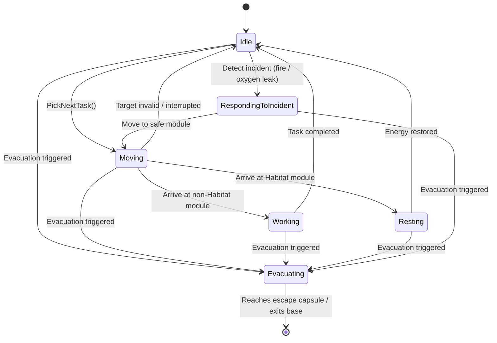
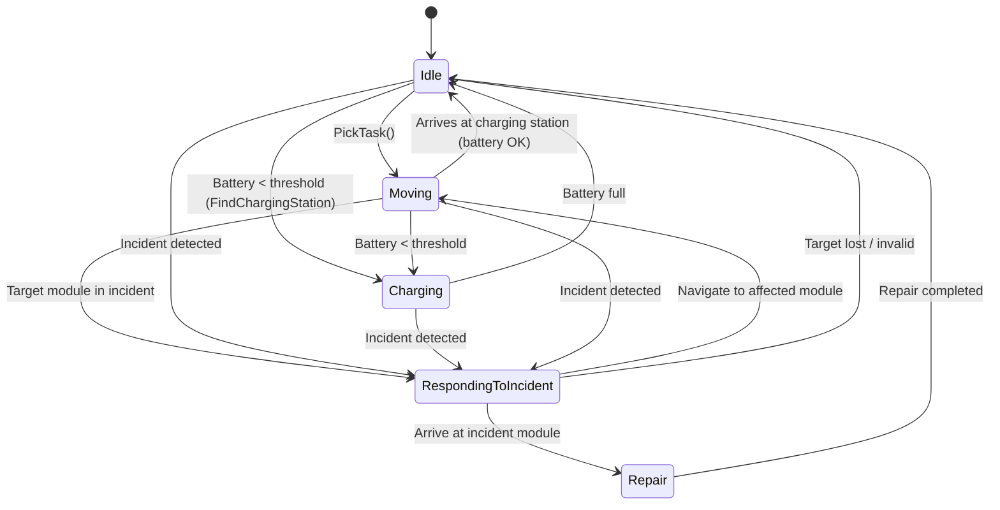

# Simulação de Colónia Marciana com Agentes Autónomos e Gestão de Incidentes (Projecto 1 Disciplina AI)

## Autores

- Diogo Meira Fonseca - nº a22402652
- joão Monteiro - nº a22302592

## Distribuição do trabalho

- Implementação dos Tripulantes: Diogo Fonseca
- Implementação dos Robos:       Diogo Fonseca
- Implementação dos Incidentes:  Diogo Fonseca
- Implementação dos Módulos:     Diogo Fonseca
- Relatório:                     Diogo Fonseca

## Introdução

Como o nome indica este projecto tenta simular uma colónia marciana com agentes autonomos, estes agentes são divididos em duas categorias Tripulantes e robos, tendo cada uma dessas categorias necessidades e objectivos diferentes, essas necessidades e objectivos correspondem a modulos especificos que podem ser afetados por incidentes, estes complicam ou impossiblitam concluir essas necessidades e objectivos.

## Metodologia

Esta simulação foi desenvolvida em Unity 3d com os assets 3d nativos do unity (planes, cylinders, spheres, etc). 

A navegação dos agentes é feita marioritariamente com NavMesh para garantir que os agentes evitariam paredes, limites e obstáculos, esse sistema facilita bastante o trabalho pois permite me utilizar de algoritmos de navegação pre feitos do unity em vez de ter que desenvolver os meus próprios. 

Os Agentes são divididos em duas categorias: Tripulantes e robos

Os tripulantes têm como necessidades dinamicas Energia, Recursos e "Necessidade de verde" estas necessidades começam com valores fixos e vão decrescendo continuamente a velocidades diferentes, o tripulante verifica o valor destas necessidades e age de acordo, dando sempre prioridade á energia, essas ações consistem de se locomover para um modulo especifico e reabastecer essa necessidade, cada necessidade corresponde a um módulo, Energia só consegue ser reabastecida nas habitações, Recursos só podem ser reabastecidos no armazém, necessidade de verde só pode ser reabastecida na estufa e caso nenhuma necessidade esteja baixa o suficiente o tripulante irá para um laboratório trabalhar, caso um numero grande de incidentes esteja ativo o tripulante começa a evacuar, a ação de evacuação consiste de se movimentar para o modulo de saida, após chegar a esse módulo o GameObject do tripulante é desativado

Os tripulantes têm um valor de Vida que ao passar por um módulo com o incidente Fogo ou Falta de Oxigénio desce, se chegar a zero o GameObject do tripulante é destruido

Eu queria ter implementado um sistema que interagia com o navmesh e faria o tripulante evitar com diferentes niveis de sériedade modulos com incidentes, mas infelizmente não consegui

O sistema de Ai do tripulante é um FSM (finite state machine)
que consiste do seguinte:

O script dos tripulantes foi um dos mais complicados de trabalhar neste projecto, acho que deveria ter dividido as suas funções em diferentes scripts para evitar este script enorme que á minima mudança deixa de funciona, admito também que poderia ter tido mais atenção aos principios SOLID e/ou utilizado de um design patter diferente neste projecto para facilitar o meu trabalho

Os robos têm apenas uma necessidade dinamica, Bateria, caso o valor dessa necessidade seja demasiado pequeno o robo irá mover-se para um modulo técnico e irá carregar a bateria continuamente, no entantanto as ações dos robos não se limitam a reabastecer essa necessidade dinamica, os robos analisam os modulos da simulação e caso encontrem algum com icidente ativo movem se até esse modulo e arranjam-no retirando assim o incidente

Os robos têm um sistema que garante que apenas um robo irá arranjar um módulo de cada vez para evitar mais que um robo arranje o mesmo incidente no mesmo módulo

O sistema de Ai do tripulante é um FSM (finite state machine)
que consiste do seguinte:

