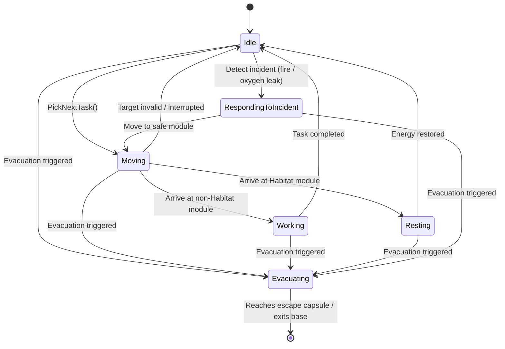
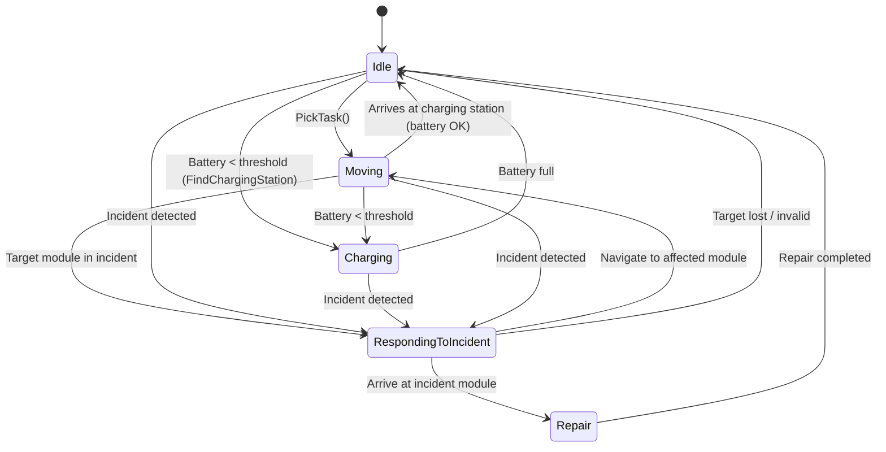
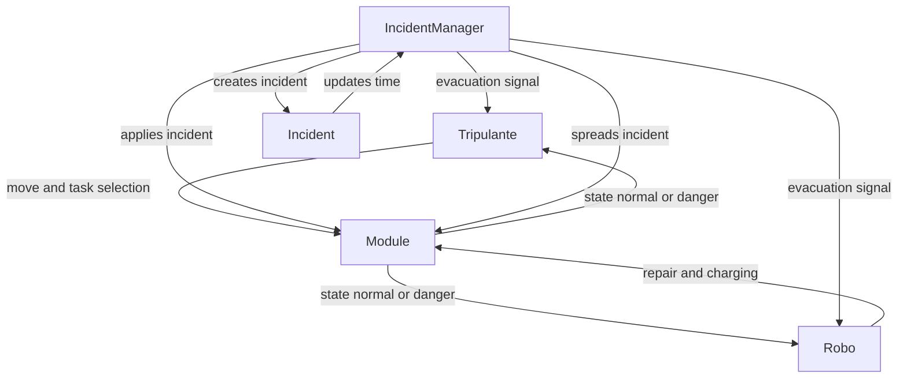

# Simulação de Colónia Marciana com Agentes Autónomos e Gestão de Incidentes (Projecto 1 Disciplina AI)

## Autores

- Diogo Meira Fonseca - nº a22402652
- joão Monteiro - nº a22302592

## Distribuição do trabalho

- Implementação dos Tripulantes: Diogo Fonseca
- Implementação dos Robos:       Diogo Fonseca
- Implementação dos Incidentes:  Diogo Fonseca
- Implementação dos Módulos:     Diogo Fonseca
- Relatório:                     Diogo Fonseca

## Introdução

Como o nome indica este projecto tenta simular uma colónia marciana com agentes autonomos, estes agentes são divididos em duas categorias Tripulantes e robos, tendo cada uma dessas categorias necessidades e objectivos diferentes, essas necessidades e objectivos correspondem a modulos especificos que podem ser afetados por incidentes, estes complicam ou impossiblitam concluir essas necessidades e objectivos.

## Metodologia

Esta simulação foi desenvolvida em Unity 3d com os assets 3d nativos do unity (planes, cylinders, spheres, etc).

Esta simulação tem um sistema de Módulos, os módulos representam as salas da colónia marciana onde os agentes executam as suas tarefas, ou seja definem tanto o espaço navegável quanto as regras das ações dos agentes

O projecto tem um Enum com os tipos de modulo esses tipos definem as interações que os agentes conseguem ter neles, esses tipos são: Habitat, Laboratory, GreenHouse, Storage, Technical e Escape

O projecto tem também um enum com cada tipo de estado que um módulo pode estar dependendo do incidente que o afeta, esse estado é mudado quando um incidente é ativado ou desativado em cada modulo, esses estados são: Normal, Fire, NoOxigen, NoPower

Eu implementei os modulos criando uma classe chamada Module onde se define o tipo e estado de cada modulo, tenta se defenir uma capacidade de agentes maxima, verifica-se entrada e saida de agentes, faz-se atribuição de robos (garante-se que apenas um robo por vez pode arranjar o mesmo modulo), tenta dar proteção contra incidentes aos modulos de escape, adiciona um cooldown quando arranjado que impede de ser afetado por um incidente imediatamente após ser arranjado, 

A navegação dos agentes é feita marioritariamente com NavMesh para garantir que os agentes evitariam paredes, limites e obstáculos, esse sistema facilita bastante o trabalho pois permite me utilizar de algoritmos de navegação pre feitos do unity em vez de ter que desenvolver os meus próprios. 

Os Agentes são divididos em duas categorias: Tripulantes e robos

Os tripulantes têm como necessidades dinamicas Energia, Recursos e "Necessidade de verde" estas necessidades começam com valores fixos e vão decrescendo continuamente a velocidades diferentes, o tripulante verifica o valor destas necessidades e age de acordo, dando sempre prioridade á energia, essas ações consistem de se locomover para um modulo especifico e reabastecer essa necessidade, cada necessidade corresponde a um módulo, Energia só consegue ser reabastecida nas habitações, Recursos só podem ser reabastecidos no armazém, necessidade de verde só pode ser reabastecida na estufa e caso nenhuma necessidade esteja baixa o suficiente o tripulante irá para um laboratório trabalhar, caso um numero grande de incidentes esteja ativo o tripulante começa a evacuar, a ação de evacuação consiste de se movimentar para o modulo de saida, após chegar a esse módulo o GameObject do tripulante é desativado

Os tripulantes têm um valor de Vida que ao passar por um módulo com o incidente Fogo ou Falta de Oxigénio desce, se chegar a zero o GameObject do tripulante é destruido

Eu queria ter implementado um sistema que interagia com o navmesh e faria o tripulante evitar com diferentes niveis de sériedade modulos com incidentes, mas infelizmente não consegui

O sistema de Ai do tripulante é um FSM (finite state machine)
que consiste do seguinte:

O script dos tripulantes foi um dos mais complicados de trabalhar neste projecto, acho que deveria ter dividido as suas funções em diferentes scripts para evitar este script enorme que á minima mudança deixa de funciona, admito também que poderia ter tido mais atenção aos principios SOLID e/ou utilizado de um design patter diferente neste projecto para facilitar o meu trabalho

Os robos têm apenas uma necessidade dinamica, Bateria, caso o valor dessa necessidade seja demasiado pequeno o robo irá mover-se para um modulo técnico e irá carregar a bateria continuamente, no entantanto as ações dos robos não se limitam a reabastecer essa necessidade dinamica, os robos analisam os modulos da simulação e caso encontrem algum com icidente ativo movem se até esse modulo e arranjam-no retirando assim o incidente

Os robos têm um sistema que garante que apenas um robo irá arranjar um módulo de cada vez para evitar mais que um robo arranje o mesmo incidente no mesmo módulo

O sistema de Ai do tripulante é um FSM (finite state machine)
que consiste do seguinte:

Os robos não têm qualquer sistema de vida e mesmo em situação de evacuação eles continuam a trabalhar normalmente para tentar conter os incidentes

O script dos robos já foi menos complicado que o dos tripulantes justamente por ser uma versão alterada do mesmo script, o problema disso foi muitos dos problemas de design de código de um script passou para o outro, efetivamente em vez de fazer um script para robos fiz um script de um tripulante robotizado

O sistema de incidentes desta simulação introdus eventos dinamicos que afetam a maneira como os agentes fazem as suas decisões

No enunciado pede para que os incidentes afetem tanto modulos quanto corredores mas infelizmente neste projecto apenas consegui implementar nos módulos 

Eu implementei o sistema através de duas classes: IncidentManager e Incident

Incident é uma classe que guarda as informações essenciais de um incidente o seu tipo a sua origem e á quanto tempo está ativo

O IncidentManager é um singleton que controla os efeitos e propagação dos incidentes, ele tem uma lista de todos os incidentes ativos e gere a criação de incidentes a sua propagação e a condição de evacuação, um incidente aleatório é criado num modulo aleatório a cada 15 segundos, inicialmente eu queria que fosse em intrevalos de tempos aleatórios mas é mais facil testar certas coisas se for em intrevalos de tempo constantes.

Os agentes tentam sempre agir de acordo com os incidentes ativos

Aqui se segue um flowchart do projecto

## Resultados e discussão

Como está neste momento o projecto funciona apesar de incompleto, os tripulantes procuram o modulo adequado para realizar as suas tarefas e escolhem qual tarefa realizar de acordo com as suas necessidades, os robos procuram modulos para arranjar, evitam arranjar um modulo que já esteja a ser arranjado e procuram por um lucal para carregar baterias quando estas estão perto de acabar, se muitos incidentes forem criados os tripulantes tentam evacuar. 

O projecto está incompleto porque os incidentes não são espalhados correctamente pois não afetam corredores, em simulações com muitos tripulantes nota se pouco pensamento diferenciado pois os parametros iniciais de todos os tripulantes são iguais, ou seja todos eles querem fazer as mesmas coisas ao mesmo tempo, infelizmente não consegui implementar um limitador que impeça tripulantes e robos de exceder a lotação maxima de cada modulo e não consegui implementar algo que fizesse com que os robos dentro do modulo técnico procorassem locais especificos para carregarem, e deveria ter implementado um estado de "roaming" para conseguir ver os robos a movimentarem se mesmo se não houver um incidente a acontecer.

Gostaria de ter implementado também "serializações" dos parametros para facilitar a utilização, tal como um ui simples para conseguir ver o numero de tripulantes que morreu e o numero que conseguio fugir.

Em simulações menores é mais facil ver comportamento inteligente por parte dos tripulantes, mas a simulação não crashou com o numero de agentes pedidos no enunciado.

Infelizmente não implementei maneira "serializada" de mudar quantos tripulantes e quantos robos aparecem na simulação.

## Conclusões 

Este projeto apresenta uma simulação de uma colónia marciana baseada em agentes autónomos, com tripulantes e robôs a interagir com diferentes módulos e a reagir a incidentes como incêndios, fugas de oxigénio e falhas elétricas.

Os resultados mostram que os agentes conseguem escolher e fazer ações normais e adaptar as suas decisões em situações de emergência, incluindo resposta a incidentes e evacuação da base. O sistema de incidentes contribuem para um comportamento mais dinâmico.

Em termos gerais, o projeto segue abordagens de simulação multi-agente e FSM, onde o comportamento e interação entre agentes é afectado pelo ambiente e eventos.

## Agradecimentos 

- Lisa Carvalho - nº a22405414 - ajudou me com a reorganização do meu projecto quando começei a confundir tudo no meu código esparguete
- Gonçalo Gonçalves - aluno de enegenharia informatica da universidade de lisboa que ajudou me com algumas partes mais complicadas do meu projecto

## Referencias 

- Unity Technologies. (2024). NavMesh Components and Navigation System.
- The Shaggy Dev. (2017). An introduction to finite state machines and the state pattern for game development [Vídeo]. YouTube. https://www.youtube.com/watch?v=-ZP2Xm-mY4E
- iHeartGameDev. (2022). How to Program in Unity: State Machines Explained [Vídeo]. YouTube.https://www.youtube.com/watch?v=Vt8aZDPzRjI